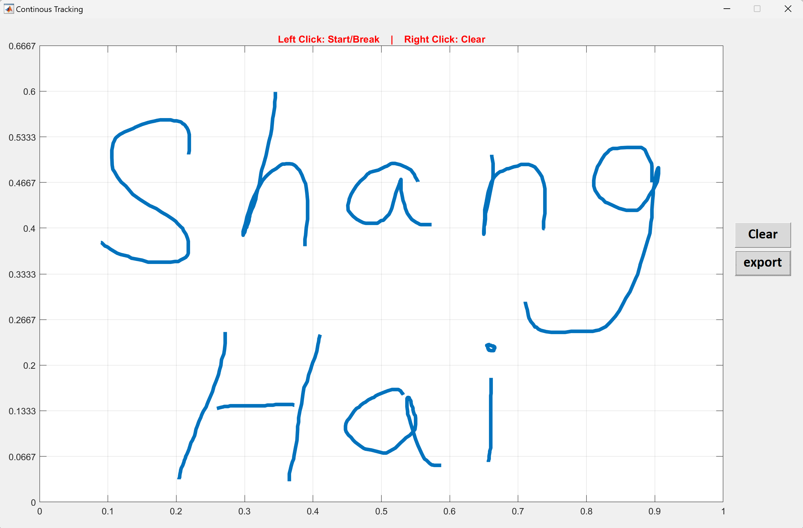
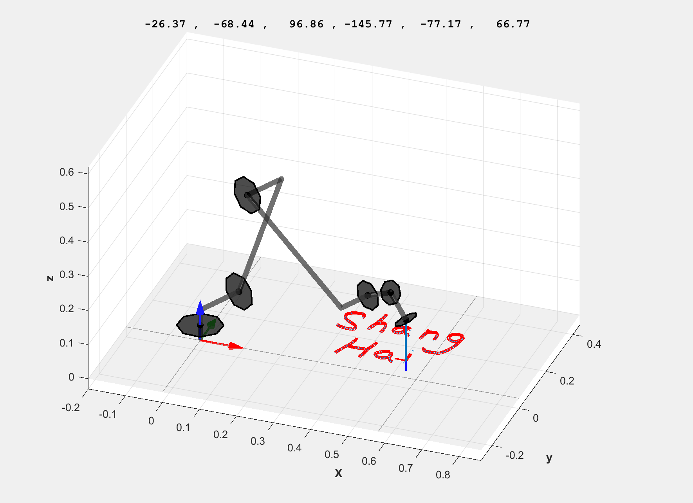

# You-Draw-Robot-Draw
 You draw something, robot draw something

Just for fun,.

Run: <u>DrawSomeThing.m</u>

Click mouse left button (don't hold) to start. Click again to stop.

When you finished, click export, UR5 will draw same thing:

